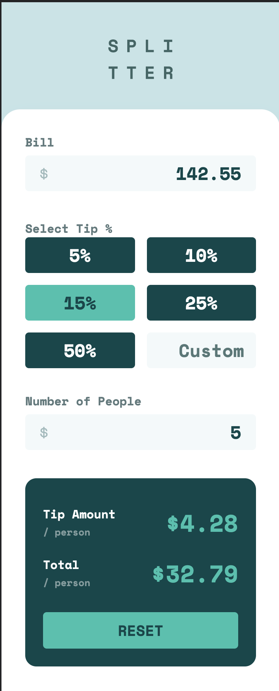
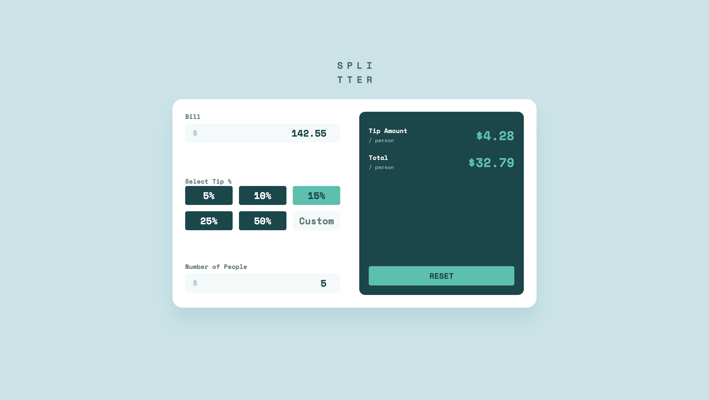

# Frontend Mentor - Tip calculator app solution

This is a solution to the [Tip calculator app challenge on Frontend Mentor](https://www.frontendmentor.io/challenges/tip-calculator-app-ugJNGbJUX). Frontend Mentor challenges help you improve your coding skills by building realistic projects.

## Table of contents

- [Overview](#overview)
  - [The challenge](#the-challenge)
  - [Screenshots](#screenshots)
  - [Links](#links)
- [My process](#my-process)
  - [Built with](#built-with)
  - [What I learned](#what-i-learned)
  - [Continued development](#continued-development)
- [Author](#author)

## Overview

### The challenge

Users should be able to:

- View the optimal layout for the app depending on their device's screen size
- See hover states for all interactive elements on the page
- Calculate the correct tip and total cost of the bill per person

### Screenshots

 
Mobile screenshot

 
Desktop screenshot

### Links

- Solution URL: [https://github.com/james-work-account/frontend-mentor-tips-calculator](https://github.com/james-work-account/frontend-mentor-tips-calculator)
- Live Site URL: [https://frontend-mentor-tips-calculator.netlify.app/](https://frontend-mentor-tips-calculator.netlify.app/)

## My process

### Built with

- Semantic HTML5 markup
- JavaScript (soon to be TypeScript, hopefully)
- Mobile-first workflow
- [Vue](https://v3.vuejs.org/) - JS library
- [Vuex](https://next.vuex.vuejs.org/) - Global state management for Vue
- [SCSS](https://sass-lang.com/) - CSS preprocessor

### What I learned

I used this challenge as an opportunity to re-learn Vue.js. I hadn't picked up Vue since Vue 3 was just a rumour floating around the internet, so now it's relatively stable I thought it was about time to give it a go.

Having used React a lot over the last couple of years, it was a nice change of pace to go back to using something as friendly and well-documented as Vue.

This was also my first attempt at using SCSS with Vue; previously I had only used standard CSS so the ability to nest media queries and use custom mixins really helped to make the development process much more pleasant.

### Continued development

I would like to re-write the JavaScript parts of this with TypeScript; since I hadn't used Vue in such a long time I thought I'd try to get it working in vanilla JavaScript before moving onto something more challenging. Ultimately, in my next challenge I think that starting out with Vue + TypeScript + SCSS will be a really good experience, now that I have a decent understanding of Vue and SCSS and (hopefully) soon Vue + TypeScript.

## Author

- GitHub - [james-work-account](https://github.com/james-work-account)
- Frontend Mentor - [@james-work-account](https://www.frontendmentor.io/profile/james-work-account)
